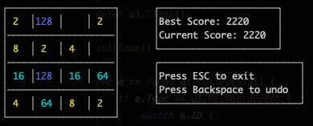

# term2048  
2048 game in Terminal, written in Go with termui library

## How to play
- Use arrows or WSAD to move
- When two cells with the same value touch, move to merge it
- If you make mistake, you can undo it with Backspace (TODO)
- Game automatically save your progress in background 

